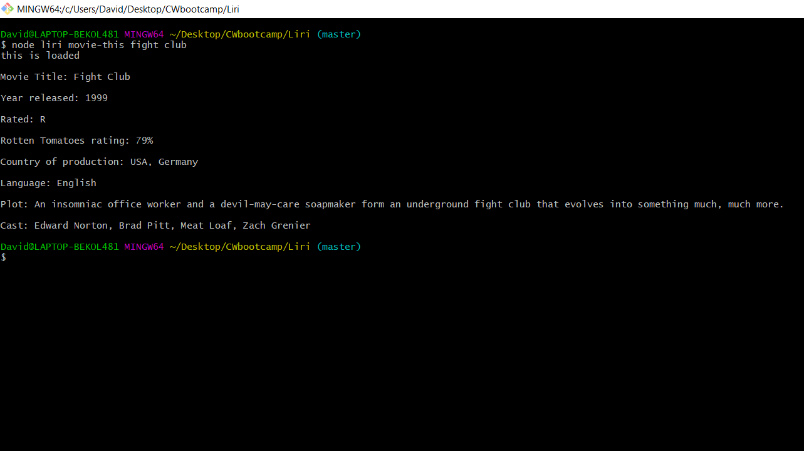
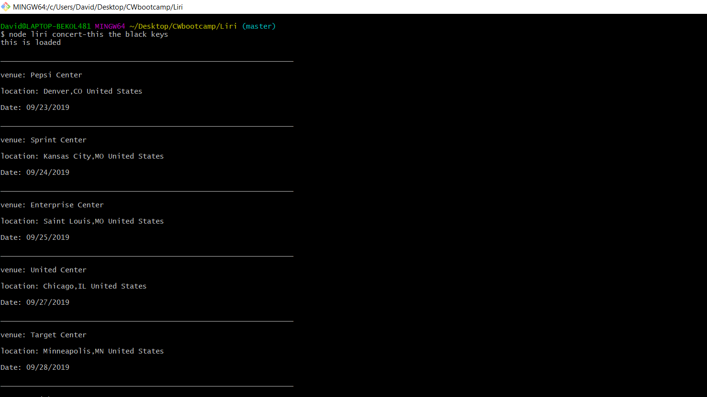
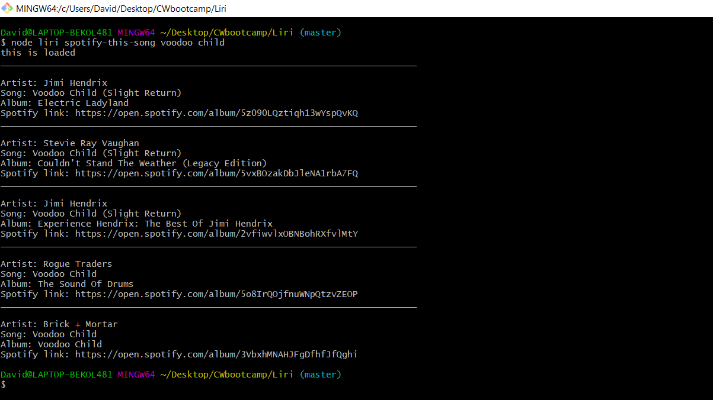

# Liri

Liri --

# Get started
    run npm install to install the required packages

## How to use

    In your terminal type "Node Liri movie-this <your search query>"

    Search for a movie title and recieve back movie information from the OMDB API using axious npm

    -returns data in command line and also logs it to log.txt

    

    In your terminal type "Node Liri concert-this <your search query>"
    
    Search for bands with upcoming concert dates from the bandsintown API  using axious npm

    -returns data in command line and also logs it to log.txt

 

    In your terminal type "Node Liri spotify-this-song <your search query>"

    Search for a song title and recieve back song information from the Spotify API using spotify npm
    
    -returns data in command line and also logs it to log.txt  

 

    In your terminal type "Node Liri do-what-it-says" 
    
    returns a predefined search using fs.readFile to prompt a search query from the random text file   
